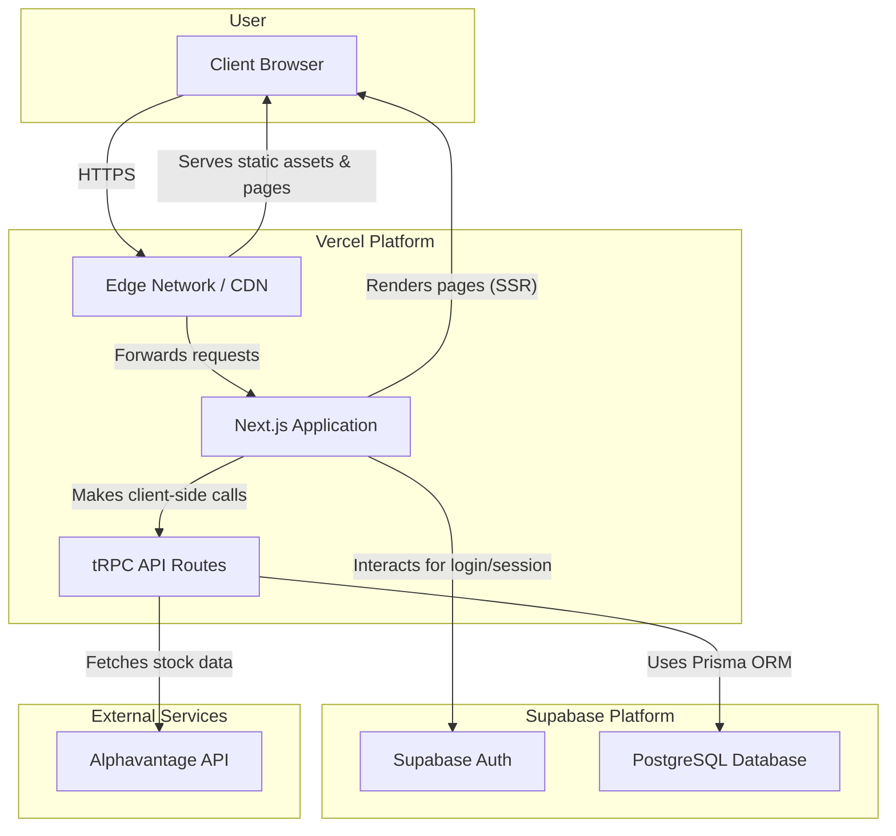
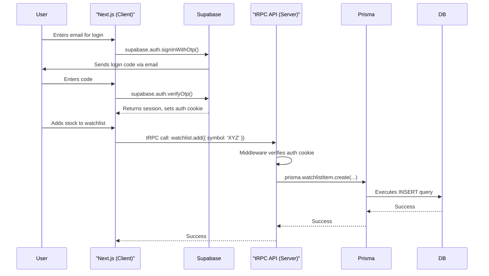

# Fullstack Architecture Document: Peak Finance

## 1. Introduction

This document outlines the complete fullstack architecture for the Peak Finance application. It synthesizes the requirements from the PRD, and UI/UX Specification into a technical blueprint designed to guide development. This architecture prioritizes type safety, performance, security, and maintainability.

The chosen platform is a combination of **Vercel** for hosting and serverless functions, and **Supabase** for the PostgreSQL database and user authentication. This provides a robust, scalable, and developer-friendly foundation.

### 1.1. Change Log

| Date | Version | Description | Author |
| --- | --- | --- | --- |
| 2025-09-02 | 1.0 | Initial draft of the architecture. | David Hargitai, dev |

## 2. High-Level Architecture

The application will be a modern server-side rendered (SSR) web application built on a serverless architecture. The frontend, API layer, and server-side rendering will all be handled by a single Next.js 15 monorepo deployed on Vercel.

### 2.1. High-Level Architecture Diagram



### 2.2. Architectural Patterns

- **Monorepo**: A single repository will manage all code (frontend, backend, shared types), managed with `pnpm workspaces`. This simplifies dependency management and ensures type safety across the stack.
- **Serverless**: The backend logic is encapsulated in Next.js API routes, which are deployed as serverless functions on Vercel, enabling automatic scaling and reducing infrastructure management.
- **End-to-End Type Safety**: **tRPC** and **Prisma** will be used to ensure that types are shared and enforced from the database schema all the way to the React components, eliminating a common class of bugs.
- **Server-State Caching**: **React Query** will be used on the client-side to manage the state of asynchronous data, providing robust caching, background re-fetching, and optimistic updates to create a smooth user experience.

## 3. Tech Stack

This table represents the definitive technology stack for the project. All development must adhere to these choices.

| Category | Technology | Version | Rationale |
| --- | --- | --- | --- |
| **Framework** | Next.js (App Router) | 15.x | Industry standard for SSR React apps; provides a robust serverless backend. |
| **Language** | TypeScript | 5.x | Enforces type safety across the entire project. |
| **API Layer** | tRPC | 11.x | Provides end-to-end type safety between the server and client. |
| **Database** | PostgreSQL (Supabase) | 15.x | Robust, open-source relational database provided by Supabase. |
| **ORM** | Prisma | 6.15.x | Modern, type-safe ORM for interacting with the database. |
| **Authentication** | Supabase Auth | latest | Secure, integrated solution for authentication and user management. |
| **Styling** | TailwindCSS + DaisyUI | 4.x / 5.1.x | Utility-first CSS for rapid UI development with a professional component library. |
| **Client State** | React Query | 5.x | Manages server state, caching, and data fetching on the client. |
| **Charting** | Apache ECharts | 6.x | Powerful and flexible charting library for data visualization. |
| **Deployment** | Vercel | latest | Natively supports Next.js with seamless CI/CD and serverless functions. |
| **Testing** | Vitest, React Testing Library | latest | Modern, fast testing framework for unit and integration tests. |

## 4. Monorepo Project Structure

The project will be organized as a monorepo to facilitate code sharing and maintainability.

```
/peak-finance-app
├── apps/
│   └── web/                      # The Next.js application
│       ├── src/
│       │   ├── app/                # Next.js App Router pages and layouts
│       │   ├── components/         # React components (UI, layout)
│       │   ├── lib/                # Client-side helpers (Supabase client)
│       │   └── server/             # Server-side code
│       │       ├── api/            # tRPC API routers
│       │       ├── db.ts           # Prisma client instantiation
│       │       └── trpc.ts         # tRPC server setup
│       └── next.config.mjs
├── packages/
│   ├── db/                       # Prisma schema and generated client
│   │   ├── prisma/
│   │   │   └── schema.prisma
│   │   └── package.json
│   └── config/                   # Shared configurations
│       ├── eslint-preset.js
│       └── tsconfig/
│           └── base.json
├── package.json
├── pnpm-workspace.yaml
└── tsconfig.json

```

## 5. Data Models & Database Schema

The database schema will be managed by Prisma. The core model is the `WatchlistItem`, which connects a user to a stock symbol.

**File: `packages/db/prisma/schema.prisma`**

```toml

generator client {
  provider = "prisma-client-js"
}

datasource db {
  provider  = "postgresql"
  url       = env("DATABASE_URL")
  directUrl = env("DIRECT_URL")
}

// Corresponds to Supabase's auth.users table
model User {
  id            String          @id @default(uuid())
  email         String?         @unique
  watchlistItems WatchlistItem[]
}

model WatchlistItem {
  id        Int      @id @default(autoincrement())
  symbol    String
  createdAt DateTime @default(now())
  userId    String
  user      User     @relation(fields: [userId], references: [id], onDelete: Cascade)

  @@unique([userId, symbol])
}

```

**Note on Supabase Auth Integration**: A database trigger will be set up in Supabase to automatically create a `User` record in our public schema whenever a new user signs up via Supabase Auth.

## 6. API Specification (tRPC)

The API will be structured into routers, separating public and protected procedures.

**File: `apps/web/src/server/api/routers/stock.ts` (Public)**

```typescript
import { z } from "zod";
import { createTRPCRouter, publicProcedure } from "../trpc";
// ... alphavantage fetch logic

export const stockRouter = createTRPCRouter({
  search: publicProcedure
    .input(z.object({ query: z.string().min(1) }))
    .query(async ({ input }) => {
      // Logic to call Alphavantage SYMBOL_SEARCH API
      // Return type: { symbol: string, name: string }[]
    }),
  getDetails: publicProcedure
    .input(z.object({ symbol: z.string().min(1) }))
    .query(async ({ input }) => {
      // Logic to call GLOBAL_QUOTE and TIME_SERIES_DAILY_ADJUSTED
      // Return combined data
    }),
});

```

**File: `apps/web/src/server/api/routers/watchlist.ts` (Protected)**

```typescript
import { z } from "zod";
import { createTRPCRouter, protectedProcedure } from "../trpc";

export const watchlistRouter = createTRPCRouter({
  get: protectedProcedure.query(({ ctx }) => {
    return ctx.prisma.watchlistItem.findMany({
      where: { userId: ctx.session.user.id },
    });
  }),
  add: protectedProcedure
    .input(z.object({ symbol: z.string() }))
    .mutation(async ({ ctx, input }) => {
      // Logic to add a symbol to the user's watchlist
    }),
  remove: protectedProcedure
    .input(z.object({ symbol: z.string() }))
    .mutation(async ({ ctx, input }) => {
      // Logic to remove a symbol
    }),
});

```

## 7. Authentication

Authentication will be managed entirely by Supabase Auth, using a one-time code via email.

### 7.1. Client vs. Server Supabase Interaction **(Critical Distinction)**

- **Client-Side (Frontend)**: The Next.js application will use the `@supabase/ssr` package. This client is cookie-based and designed to manage user sessions securely within the browser. It handles login, logout, and provides session information to both client and server components.
- **Server-Side (Backend/tRPC)**: The backend logic within our tRPC API routes will **NOT** use the cookie-based client. Instead, it will interact with the database via the **Prisma client**. Prisma is configured with a direct, secure database connection string (containing the database password) stored in server-side environment variables. This is a trusted, **service-based connection**. The tRPC `protectedProcedure` will authorize actions by verifying the user's session (provided by the client), but the database operations themselves are executed by Prisma with its own secure credentials.

### 7.2. Login Flow Diagram



## 8. Deployment

- **Provider**: Vercel.
- **Process**: The application will be linked to a GitHub repository. Every push to the `main` branch will trigger an automatic build and deployment.
- **Environment Variables**: All sensitive keys (Supabase URL, anon key, service role key, Prisma direct URL, Alphavantage API key) will be configured as environment variables in the Vercel project settings.

## 9. Testing Strategy

- **Unit Tests**: Core business logic, utility functions, and individual React components will be tested in isolation using Vitest and React Testing Library.
- **Integration Tests**: tRPC procedures will be tested to ensure they correctly interact with the Prisma client and implement business logic as expected. Mocking will be used for the database and external APIs.

## 10. Coding Standards for AI Agents

- **Type Safety is Paramount**: All functions and variables must have explicit types. The `any` type is forbidden.
- **Environment Variables**: Access environment variables only through a centralized configuration module. Never use `process.env` directly in components or API logic.
- **API Interaction**: All data fetching must be done through tRPC hooks (`api.stock.search.useQuery`). Direct `fetch` calls are not allowed.
- **Database Interaction**: All database operations must go through the Prisma client. No raw SQL queries are permitted.
- **Error Handling**: All tRPC procedures must include structured error handling and return specific tRPC error codes.
- **UI Development**: When creating UI components, always use DaisyUI and TailwindCSS classes to ensure consistent styling and layout. Always try to look up DaisyUI and TailwindCSS documentation first for the best practices and how to use a component. Never use inline styles or CSS classes.
- **Next.js Component Architecture**: Components are Server Components by default unless explicitly marked with `'use client'`. Never add `'use client'` unless the component requires:
  - React hooks (`useState`, `useEffect`, `useContext`, etc.)
  - Browser-only APIs (localStorage, window, document)
  - Event handlers (onClick, onChange, etc.)
  - Third-party libraries that use browser APIs
- **Minimize Client Component Boundaries**: Only mark the smallest possible component as `'use client'`. Never mark parent components as Client Components when only a child needs interactivity.
  - ❌ BAD: Making entire page a Client Component
  - ✅ GOOD: Only interactive components (forms, buttons with state) as Client Components
- **Component Hierarchy**: Structure components to maximize SSR benefits:
  - Pages and layouts: Server Components (no `'use client'`)
  - Static UI components: Server Components (navigation bars, footers, headers)
  - Interactive components: Client Components (search inputs, forms, modals)
- **State Management Location**: Keep state in the lowest component that needs it. If only SearchInput needs suggestions state, don't lift it to the page level.
- **YAGNI (You Aren't Gonna Need It)**: 
  - Remove unused imports, variables, and functions immediately
  - Delete dead code and commented-out blocks
  - Don't add features or dependencies "just in case" 
  - Every import and dependency must serve an immediate purpose