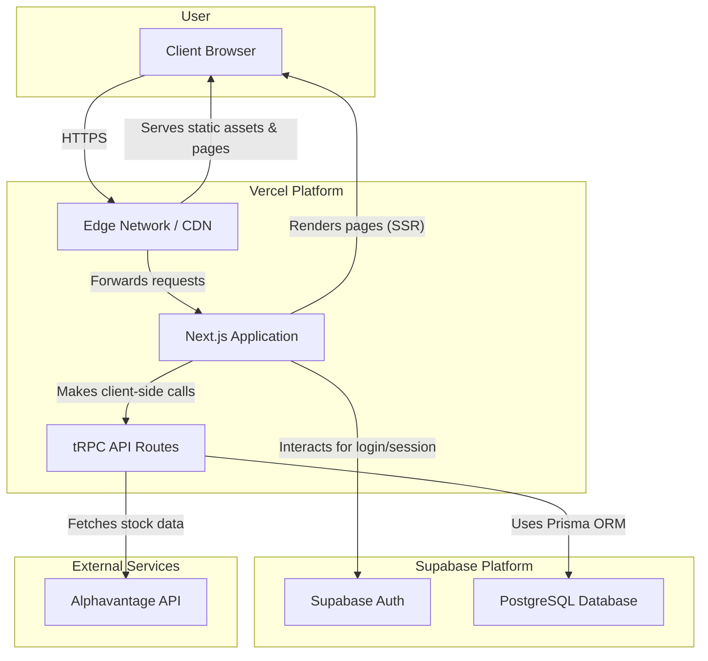

# 2. High-Level Architecture

The application will be a modern server-side rendered (SSR) web application built on a serverless architecture. The frontend, API layer, and server-side rendering will all be handled by a single Next.js 15 monorepo deployed on Vercel.

## 2.1. High-Level Architecture Diagram

## 2.2. Architectural Patterns

- **Monorepo**: A single repository will manage all code (frontend, backend, shared types), managed with `pnpm workspaces`. This simplifies dependency management and ensures type safety across the stack.
- **Serverless**: The backend logic is encapsulated in Next.js API routes, which are deployed as serverless functions on Vercel, enabling automatic scaling and reducing infrastructure management.
- **End-to-End Type Safety**: **tRPC** and **Prisma** will be used to ensure that types are shared and enforced from the database schema all the way to the React components, eliminating a common class of bugs.
- **Server-State Caching**: **React Query** will be used on the client-side to manage the state of asynchronous data, providing robust caching, background re-fetching, and optimistic updates to create a smooth user experience.
