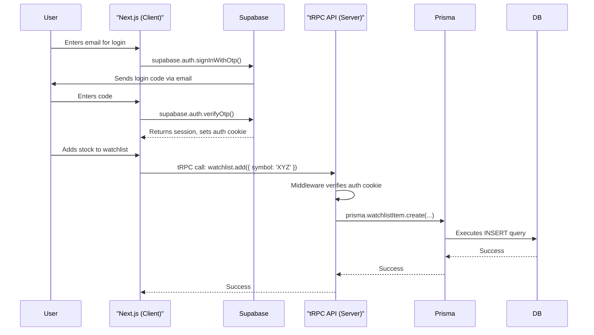

# 7. Authentication

Authentication will be managed entirely by Supabase Auth, using a one-time code via email.

## 7.1. Client vs. Server Supabase Interaction **(Critical Distinction)**

- **Client-Side (Frontend)**: The Next.js application will use the `@supabase/ssr` package. This client is cookie-based and designed to manage user sessions securely within the browser. It handles login, logout, and provides session information to both client and server components.
- **Server-Side (Backend/tRPC)**: The backend logic within our tRPC API routes will **NOT** use the cookie-based client. Instead, it will interact with the database via the **Prisma client**. Prisma is configured with a direct, secure database connection string (containing the database password) stored in server-side environment variables. This is a trusted, **service-based connection**. The tRPC `protectedProcedure` will authorize actions by verifying the user's session (provided by the client), but the database operations themselves are executed by Prisma with its own secure credentials.

## 7.2. Login Flow Diagram

