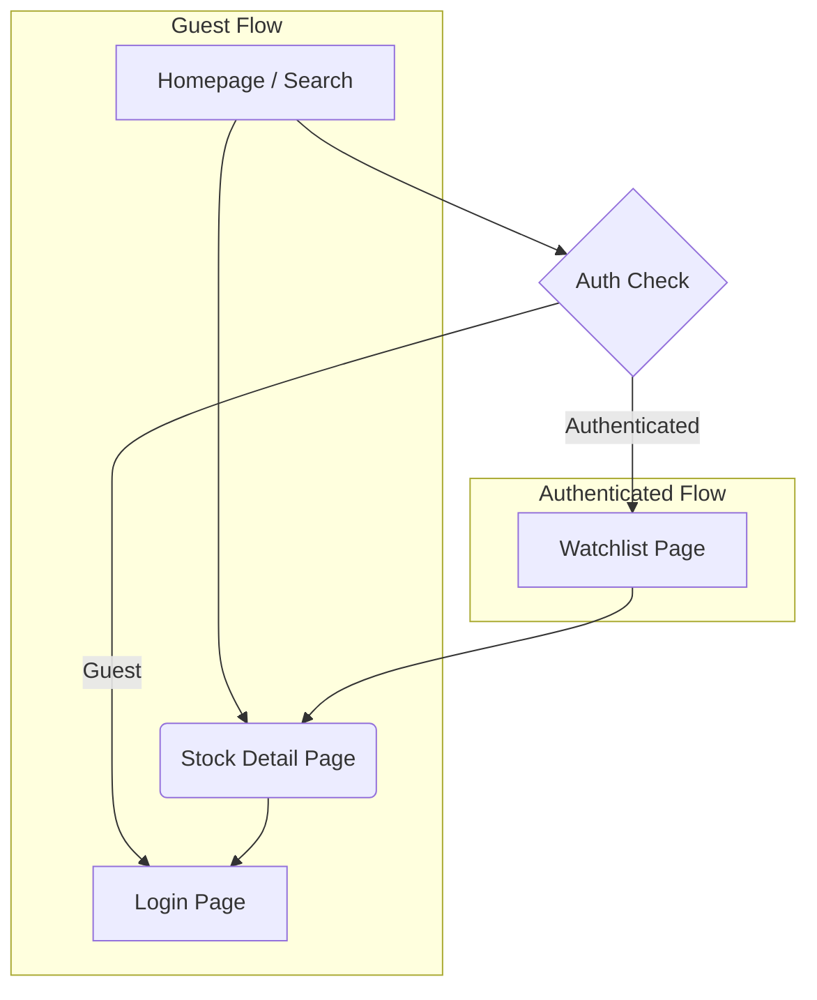
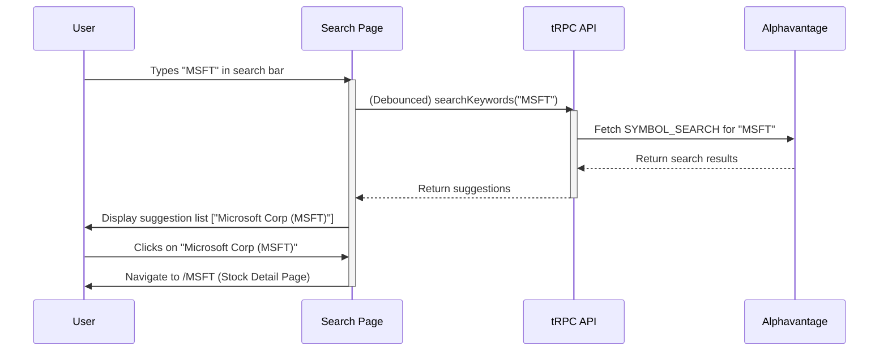
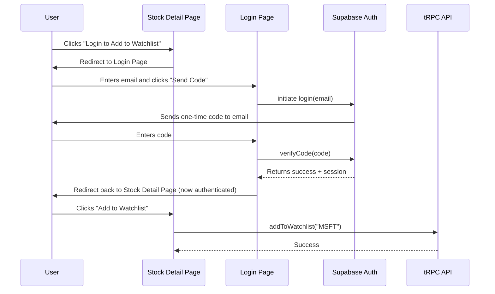

# UI/UX Specification: Peak Finance

## 1. Introduction

This document defines the user experience (UX) and user interface (UI) specifications for the Peak Finance application. It is based on the Product Requirements Document (PRD) and serves as the primary guide for frontend architecture and development. The goal is to ensure a user-centered, intuitive, and cohesive experience across the entire platform.

### 1.1. Overall UX Goals & Principles

- **Clarity First**: Prioritize clear data presentation and intuitive navigation over complex or novel UI patterns. Users should understand information at a glance.
- **Performance is a Feature**: The interface must feel fast and responsive. All interactions, from search suggestions to chart loading, should be optimized for speed.
- **Progressive Disclosure**: Provide users with the information they need, when they need it. Guests have a simple, focused search experience, while authenticated users gain access to deeper personalization features.
- **Consistency**: Maintain consistent layouts, terminology, and interaction patterns throughout the application to build user confidence and reduce cognitive load.

### 1.2. Change Log

| Date | Version | Description | Author |
| --- | --- | --- | --- |
| 2025-09-02 | 1.0 | Initial draft of the UI/UX Specification. | David Hargitai, dev |

## 2. Information Architecture

The application is structured around a few key views, supporting both guest and authenticated user journeys.

### 2.1. Site Map

The following diagram illustrates the primary pages and their relationships.



## 3. User Flows

### 3.1. Guest User: Search for a Stock

**Goal**: A guest user wants to quickly find and view information about a specific stock.



### 3.2. New User: Login and Save a Stock

**Goal**: A new user wants to log in for the first time to save a stock to their watchlist.



## 4. Wireframes (ASCII)

### 4.1. Search Page (Homepage)

**Default State:**

```
+-----------------------------------------------------------------+
| Peak Finance                                [Login] [Watchlist] |
+-----------------------------------------------------------------+
|                                                                 |
|                  Find Your Next Winning Stock                   |
|              +-----------------------------------+              |
|              | Search symbol or company...     |🔍|              |
|              +-----------------------------------+              |
|                                                                 |
|                                                                 |
|                                                                 |
+-----------------------------------------------------------------+

```

**With Type-Ahead Suggestions:**

```
+-----------------------------------------------------------------+
| Peak Finance                                [Login] [Watchlist] |
+-----------------------------------------------------------------+
|                                                                 |
|                  Find Your Next Winning Stock                   |
|              +-----------------------------------+              |
|              | aapl                            |🔍|              |
|              +-----------------------------------+              |
|              | Apple Inc. (AAPL)                 |              |
|              |-----------------------------------|              |
|              | AAP - Advance Auto Parts          |              |
|              |-----------------------------------|              |
|              | APLS - Apellis Pharmaceuticals    |              |
|              +-----------------------------------+              |
|                                                                 |
+-----------------------------------------------------------------+

```

### 4.2. Stock Detail Page

```
+--------------------------------------------------------------------------+
| Peak Finance                                         [Logout] [Watchlist] |
+--------------------------------------------------------------------------+
|                                                                          |
|  Apple Inc. (AAPL)                               [+ Add to Watchlist]    |
|  ======================================================================  |
|                                                                          |
|  $175.50 USD   <span style="color:green;">+2.10 (1.21%)</span>                                     |
|                                                                          |
|  +-------------+---------------+-------------+------------------------+  |
|  | Open        | High          | Low         | Prev. Close            |  |
|  | $173.80     | $176.10       | $173.50     | $173.40                |  |
|  +-------------+---------------+-------------+------------------------+  |
|                                                                          |
|  +--------------------------------------------------------------------+  |
|  |                                                                    |  |
|  |   [   Historical Price Chart (Apache ECharts)   ]                  |  |
|  |                                                                    |  |
|  +--------------------------------------------------------------------+  |
|                                                                          |
+--------------------------------------------------------------------------+

```

### 4.3. Watchlist Page

**Populated State:**

```
+-----------------------------------------------------------------+
| Peak Finance                                   [Logout] [Search] |
+-----------------------------------------------------------------+
|                                                                 |
|  My Watchlist                                                   |
|  =============================================================  |
|                                                                 |
|  +-----------------------------------------------------------+  |
|  | Apple Inc. (AAPL)      $175.50 <span style="color:green;">+1.21%</span>  [Remove] |  |
|  +-----------------------------------------------------------+  |
|  | Microsoft Corp (MSFT)  $310.20 <span style="color:red;">-0.55%</span>   [Remove] |  |
|  +-----------------------------------------------------------+  |
|  | Tesla Inc. (TSLA)      $250.00 <span style="color:green;">+3.50%</span>  [Remove] |  |
|  +-----------------------------------------------------------+  |
|                                                                 |
+-----------------------------------------------------------------+

```

**Empty State:**

```
+-----------------------------------------------------------------+
| Peak Finance                                   [Logout] [Search] |
+-----------------------------------------------------------------+
|                                                                 |
|  My Watchlist                                                   |
|  =============================================================  |
|                                                                 |
|           Your watchlist is empty.                              |
|           Search for stocks to add them to your list.           |
|                                                                 |
|                        [Find Stocks]                            |
|                                                                 |
|                                                                 |
+-----------------------------------------------------------------+

```

## 5. Component Inventory

- **Navbar**: Main site navigation. Varies for guest/authenticated users.
- **SearchInput**: Debounced text input with a suggestion dropdown.
- **StockQuoteCard**: Displays key quote data on the detail page.
- **PriceChart**: Wrapper for the Apache ECharts component.
- **WatchlistButton**: "Add/Remove" button with state based on the user's watchlist.
- **WatchlistItem**: A single row in the watchlist view.
- **LoginForm**: Modal or page for the email code authentication flow.

## 6. Responsiveness Strategy

- **Mobile-First**: All layouts will be designed for mobile first, then scaled up.
- **Flexible Grids**: The stock detail page's quote data will use a flexible grid that wraps to a single column on mobile.
- **Navbar Collapse**: The main navigation will collapse into a hamburger menu on smaller screens.
- **Chart Resizing**: The chart will resize to fit the container width on all devices.
